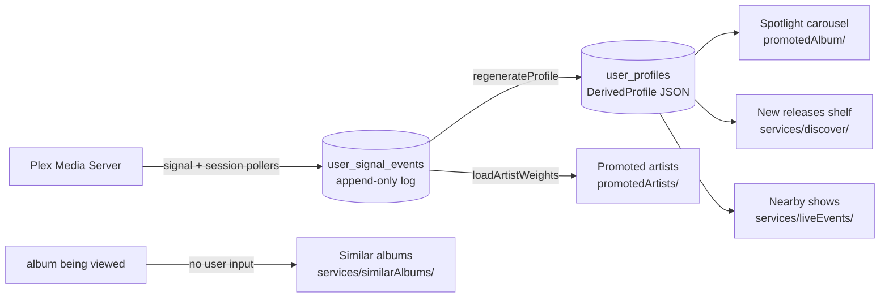

# Data and recommendation flows

Mermaid diagrams for how listening data gets into Tunearr and how each recommender turns it
into something on screen. Every diagram is drawn from the code it describes; the file and
function names in the nodes are the real ones.

Start here:

| Document                                           | What it covers                                                                   |
| -------------------------------------------------- | -------------------------------------------------------------------------------- |
| [plex-ingestion.md](plex-ingestion.md)             | Reading Plex into `user_signal_events`, and folding those events back into state |
| [profile-derivation.md](profile-derivation.md)     | Turning the raw series into the persisted `UserProfile` document                 |
| [promoted-album.md](promoted-album.md)             | The spotlight carousel and its three picking modes                               |
| [promoted-artists.md](promoted-artists.md)         | The promoted-artists grid                                                        |
| [new-releases.md](new-releases.md)                 | The blended new-releases shelf and the followed-artist pipeline behind it        |
| [similar-albums.md](similar-albums.md)             | Album-page similarity, the one recommender that ignores who is asking            |
| [live-events-affinity.md](live-events-affinity.md) | Ranking nearby shows against the taste profile                                   |

## The shape of it

Everything personal hangs off one chain: Plex is read into an append-only event log, the log
is folded into weighted taste, the weighted taste is persisted as one profile document, and
every user-facing recommender reads that document rather than Plex.

`similarAlbums` is deliberately outside the chain: it describes the album being viewed, not
the viewer, which is what lets one cache entry serve everyone.
