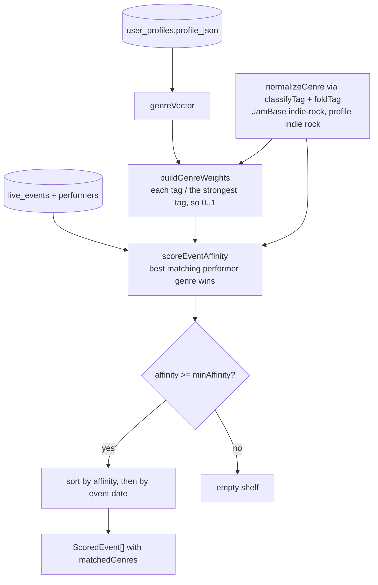

# Nearby shows: taste affinity

Concerts near the user, ranked against their genre vector. The event data itself comes from
a JamBase sweep on its own poller; this document covers the ranking, which is the part that
reads the taste profile.

Code: `server/services/liveEvents/affinity.ts` (plus `nearby.ts`, `geoSweep.ts`,
`rosterSweep.ts` for how events get into the database).

Three decisions carry the behaviour:

- **Relative weights, not absolute.** Dividing by the user's strongest tag makes the
  affinity floor mean the same thing for a heavy listener and a light one.
- **Best match wins, not the sum.** A band tagged with ten genres should not outrank a
  perfect match just for being verbosely tagged.
- **The shelf is allowed to be empty.** Ranking alone would fill every slot each day with
  the least-bad options, and a shelf that is always full teaches people to stop looking at
  it. Being empty most weeks is the intended behaviour.

Genre strings from JamBase and from Last.fm only compare after passing through the same
canonicalization the genre vector was built with. Skipping that meant an event tagged
`drum-and-bass` scored zero against a profile storing `drum and bass`.
