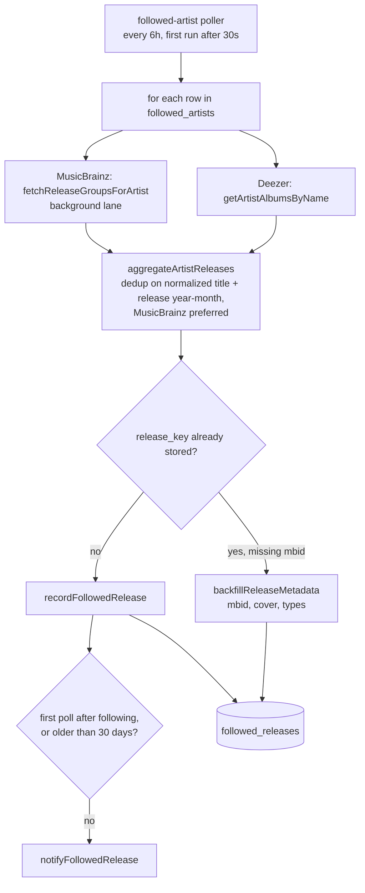
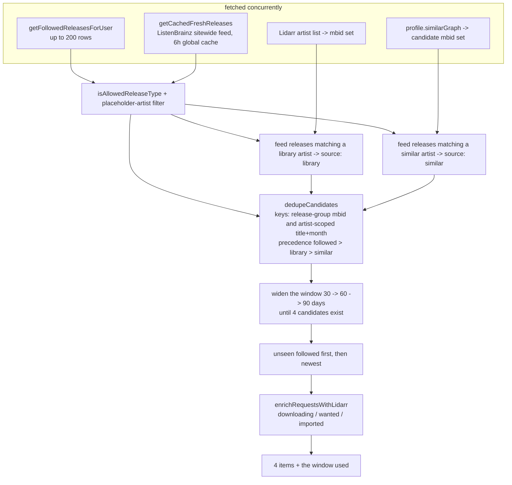

# New releases shelf

Four cards on Discover blending three tiers: releases by artists the user follows, releases
by artists in the Lidarr library, and releases by artists adjacent to the user's taste. Two
different pipelines feed it, one persisted and one cached in memory.

Code: `server/services/discover/newReleases.ts`, `feedCache.ts`,
`server/services/followed/`.

## The followed pipeline (persisted, poller-driven)

The first poll after following records the entire back catalogue, and none of it is news to
the person who just chose to follow that artist, so notifications are suppressed for it.

## The blend (per request)

The artist-scoped title key exists so a followed row written before its mbid backfill still
suppresses its twin from the ListenBrainz feed, without colliding across artists. The window
widens rather than the count shrinking, because a half-empty shelf reads as broken while a
90 day window reads as quiet.
