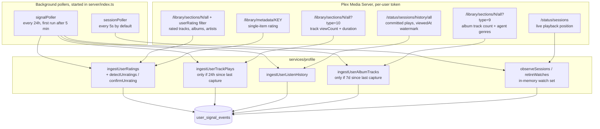
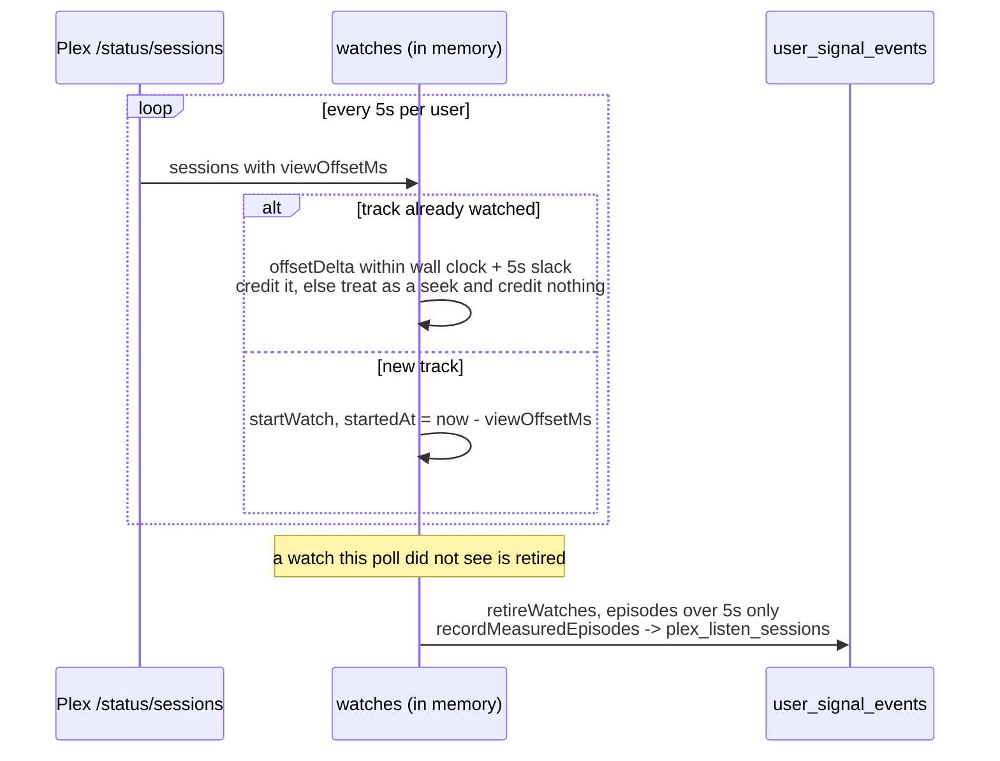
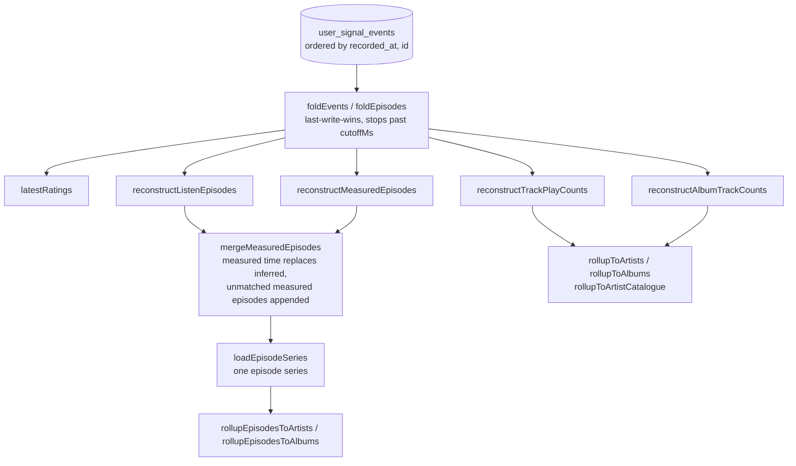

# Plex ingestion

Tunearr never recommends off a live Plex query. Two pollers copy Plex into an append-only
log (`user_signal_events`), and every reader folds that log back into state. The log is the
durable copy of signals Plex itself can lose (history purges, library re-imports) and the
only place trends can be measured from, since a cumulative counter cannot be diffed against
its own past.

Code: `server/api/plex/`, `server/services/profile/`, `server/db/userProfile.ts`.

## What is read, and by which poller

Ordering inside one sweep matters: plays are captured before history, so an episode for a
track first seen this sweep already has its length stored when it joins onto it. Both
pollers are gated on `promotedAlbum.ratingsBackupEnabled` and assume a single instance.

## Event kinds

Everything is a delta. Nothing is ever updated in place.

| Kind                   | Written by                | Payload                               | Semantics                                                                    |
| ---------------------- | ------------------------- | ------------------------------------- | ---------------------------------------------------------------------------- |
| `plex_rating`          | `ingestUserRatings`       | one rated item                        | new, changed, key-backfilled, or a confirmed clear (`rating: 0`)             |
| `plex_track_plays`     | `ingestUserTrackPlays`    | tracks whose count grew               | monotonic; also re-emitted to backfill `durationMs`                          |
| `plex_album_tracks`    | `ingestUserAlbumTracks`   | albums whose count or genres changed  | not monotonic, any difference is recorded                                    |
| `plex_listen_history`  | `ingestUserListenHistory` | episodes, keyed `ratingKey:viewedAt`  | one row per committed play, with `startedAt` back-derived                    |
| `plex_listen_sessions` | `recordMeasuredEpisodes`  | episodes, keyed `ratingKey@startedAt` | observed listening, including plays that never committed                     |
| `plex_plays`           | nothing, read only        | artist-level counts                   | the legacy series, kept because it is the only record of pre-cutover history |

Large captures are chunked at 2000 items per event. The fold is last-write-wins in written
order, so N ordered chunks reconstruct identically to one oversized event.

## Session watching

The history log records which plays happened; it cannot see a 90 minute set abandoned after
twelve minutes, because Plex commits a play at the halfway mark or not at all. The session
poller is the only source that can.

The position is the evidence, not `Player.state`, which has been observed reporting `paused`
while audio played. A failed read keeps the user's windows open rather than committing them
early. Watches are memory-only: a restart loses the windows in flight.

## Reading the log back

Two rules keep this honest:

- **One source per window.** History and the cumulative counts describe the same plays, so
  `historyCovers()` decides per window (and `coverageIndex()` per bucket) which one is read.
  Adding both would count every play inside the covered span twice.
- **Milliseconds are the currency.** `listenedMs` is observed where a session witnessed the
  play and inferred as `plays x track length` otherwise, capped by
  `maxTrackMinutesForWeight`. `toPlayEquivalents()` converts back to play-equivalents
  (one nominal 210s play is `1`) so the play-denominated thresholds keep meaning what they
  meant. `listeningWeight` at `0` ranks on decisions to press play, at `1` on exposure time.
