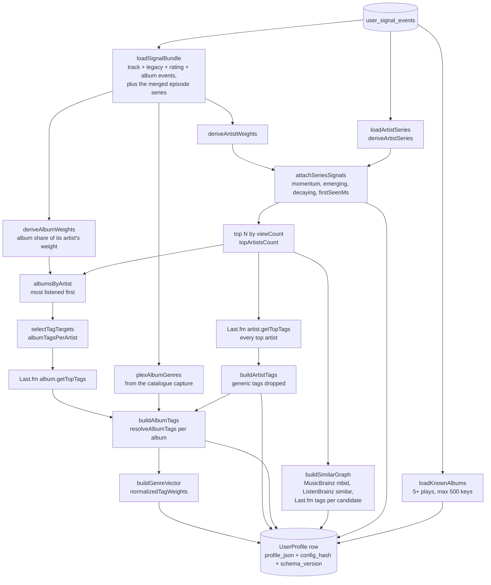
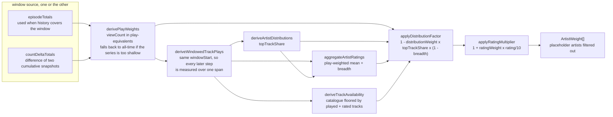
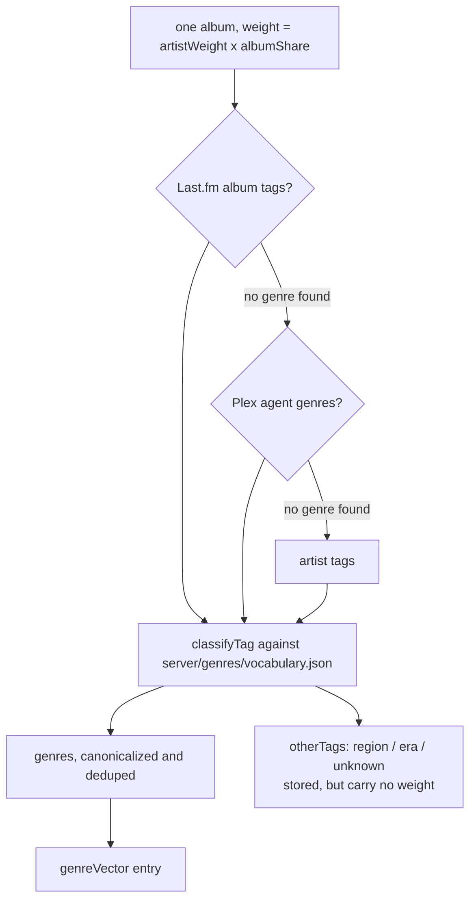
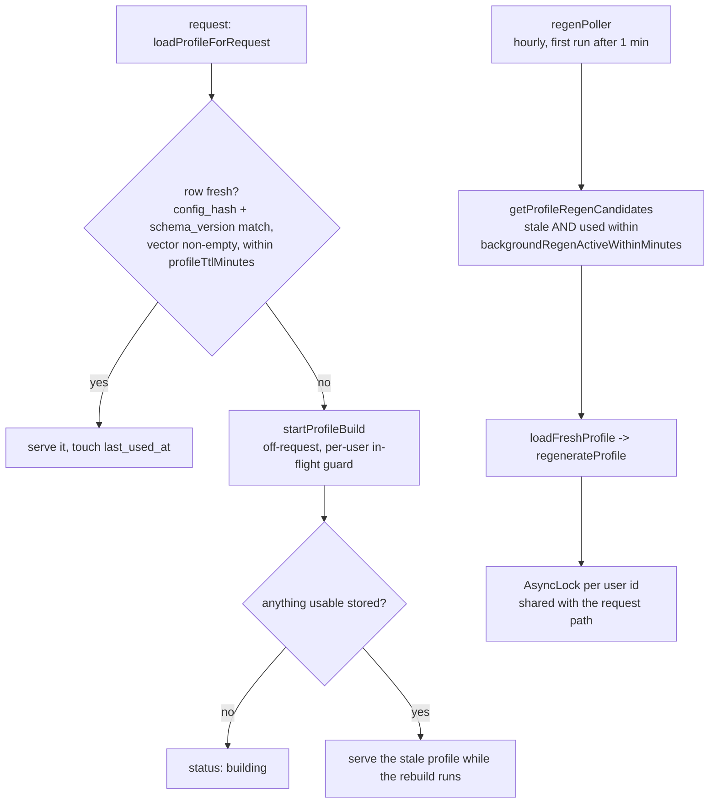

# Profile derivation

`regenerateProfile()` turns the event log into one persisted document, `DerivedProfile`,
stored as `profile_json` on `user_profiles`. Every personal recommender reads that document.
The expensive fan-out (Plex fold, Last.fm tags, MusicBrainz ids, ListenBrainz similarity)
happens here, once, and never on a request path.

Code: `server/promotedAlbum/profileService.ts`, `artistWeights.ts`, `artistSeries.ts`,
`albumGenres.ts`, `explore.ts`, `knownAlbums.ts`, `server/genres/classify.ts`.

## The whole build

Exploration history (`explorationHistory`) is carried forward across a regenerate rather
than rebuilt: it is anti-repeat memory, not derived taste.

## How an artist's weight is built

The two corrections are deliberately in tension. The distribution factor discounts an artist
whose listening sits on one track; rating breadth refutes that read, because stars spread
across the catalogue are direct evidence against a one-hit artist. Artists whose library
catalogue is at or below `minAvailableTracksForDistribution` are exempt outright: played-only
data cannot tell "the library holds one track by them" from "eleven tracks never played".

## Where genre attaches

Genre hangs off the album, not the artist. An artist still contributes exactly its play
weight to the vector; that weight is divided across its records by how much each was
actually listened to, so an acoustic side-record pulls only its own share into the wrong tag.

A source that yields no _genre_ is skipped rather than accepted, so an album Last.fm only
knows as "nigerian" still inherits its artist's genres, and the region is kept separately.
Recommending by nationality while believing you are recommending by genre is the failure
this split exists to prevent. A genre-less album falls back rather than emptying the vector.

## Freshness and who triggers a rebuild

A profile build walks every played track and resolves seeds against MusicBrainz at roughly
one request per second, which is minutes on a cold start. That is why nothing awaits it on
a request, and why `config_hash` exists: changing a weighting knob in settings invalidates
every stored profile without a migration.
