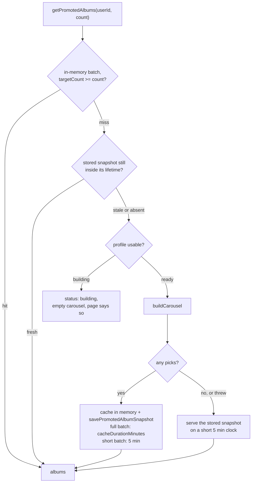
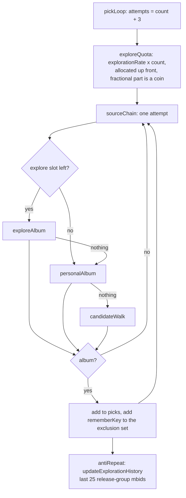
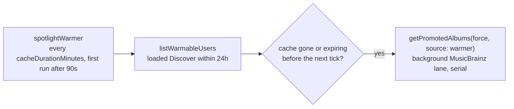

# Spotlight carousel (promoted albums)

Five recommendations on the Discover page, built from the persisted profile. Three sources
produce them, tried in a fixed order per pick, and each carries the record of the run that
produced it.

The build is executed by the graph runtime rather than by a hand-written sequence: the nodes
below are the ones declared in `server/recommenderGraph/nodes.ts` and drawn on the
recommendations settings page, and `buildCarousel` asks the runtime for `antiRepeat`. Which
steps that pulls in is the registry's answer, not this file's.

Code: `server/recommenderGraph/runtime/executor.ts`, `server/promotedAlbum/pickGraph.ts`,
`pickExplain.ts`, `explore.ts`, `personal.ts`, `tagChart.ts`, `genreBand.ts`,
`preference.ts`, `getPromotedAlbum.ts` (the caching and snapshot shell), `warmer.ts`.

## Serving a request

The snapshot is not a staleness compromise: it holds exactly what the in-memory entry held
before the process exited, so serving it is the layer-2 cache surviving a restart. A build
that comes up short lapses on a 5 minute clock instead of the full one, because a shortfall
is usually a MusicBrainz wobble, and retrying a 30-lookup build on every page load turns one
outage into a self-inflicted one.

## One build, five picks

Explore slots are a quota over the build rather than a coin per pick, so a five-album
carousel cannot come back all jumps or none by chance. Every pick shares one
`ResolutionBudget` of 30 paced MusicBrainz lookups; a source that burns the whole budget
leaves the fallback nothing to spend, which is an empty carousel rather than a worse one.
A pick that throws costs one spare attempt instead of the whole request.

`exploreQuota`, `sourceChain` and `pickLoop` are combinator nodes rather than steps, because
none of this is a DAG: rationing, ordering and repeating are all decisions about _when_ an
input runs. The runtime hands those nodes a way to run an input themselves instead of
settling every input before the body starts, and `sourceChain` reads the order of the three
sources off the registry — so reordering them on the canvas reorders which one gets first
refusal.

## The three sources

```mermaid
flowchart LR
  subgraph explore["explore: similar vibe, different genre"]
    e1["weighted draw of a seed from similarGraph"]
    e2["keep candidates whose genre overlap<br/>is at or below genreOverlapThreshold"]
    e3["the libraryPreference side<br/>(relaxes if empty)"]
    e4["rank by ListenBrainz score"]
    e5["fetchReleaseGroupsForArtist,<br/>allowed release type, dated"]
    e1 --> e2 --> e3 --> e4 --> e5
  end

  subgraph personal["personal: adjacent to what you play"]
    p1["collectCandidates: every neighbour in the graph,<br/>weight = seed play weight x similarity,<br/>summed across seeds"]
    p2["withinTastePool: overlap above the same threshold<br/>(widens to the whole graph if empty)"]
    p3["the libraryPreference side<br/>(relaxes if empty)"]
    p4["weighted draw of up to 3 artists"]
    p5["eligibleAlbums: allowed release type, dated,<br/>not in knownAlbums"]
    p1 --> p2 --> p3 --> p4 --> p5
  end

  subgraph within["within taste: the tag chart"]
    w1["sample pickedArtistsCount artists,<br/>weighted by viewCount, re-rolled per pick"]
    w2["buildGenreVector from their albums"]
    w3["weighted draw of one tag"]
    w4["Last.fm tag.getTopAlbums, page 1 + a random deep page"]
    w5["orderByPreference, then walk:<br/>resolve, allowed type, not recently shown"]
    w1 --> w2 --> w3 --> w4 --> w5
  end
```

The same genre-overlap line partitions the graph: explore takes the far side, personal takes
the near side, so the two modes never compete for the same candidate. It has one definition,
in `genreBand.ts`, and an artist nobody has tagged falls in neither band. The library line is
read the same way by both graph sources; the tag path expresses it as an ordering instead,
which is the same rule over a walk that stops at its first qualifying candidate. All three
prefer a record that has not been shown recently and show a repeat rather than nothing. The tag path is last
because it knows nothing about the user past one tag string, and a genre's global chart
converges on the canonical famous records a fan of that genre already owns. It stays because
it is the only source that works before a similar graph exists.

The artist sample is drawn per pick, not stored on the profile. Sampling at regeneration
time froze one draw of three artists into every recommendation for the whole TTL.

## Why this record

Each recommendation carries a `RecommendationTrace`: which nodes ran for that one pick, in
the order they ran, whether each handed anything on, and what each had to say about its own
turn. The facts come from `explain(inputs, output, ctx)`, which the runtime calls after the
body on values already produced — so a trace can never change what is recommended, and an
explainer that throws costs its facts rather than the album.

The quota's turn is prepended to every pick's record: it runs once for the build, and it is
what decided whether that slot was allowed a genre jump.

Discover draws it on this same chart, fetched knobless from
`GET /api/recommendations/graph/spotlight`. Steps the pick never reached are faded, the step
the record came from is ringed, and the legend says what was left of the lookup allowance.
Lists of candidates are capped (`cappedItems`), keeping the one that was chosen and counting
the rest: five picks of a hundred-odd neighbours each is a response measured in hundreds of
kilobytes.

## Warming

A warmer build does not register as the user visiting Discover, or warming would keep
renewing its own reason to run.
