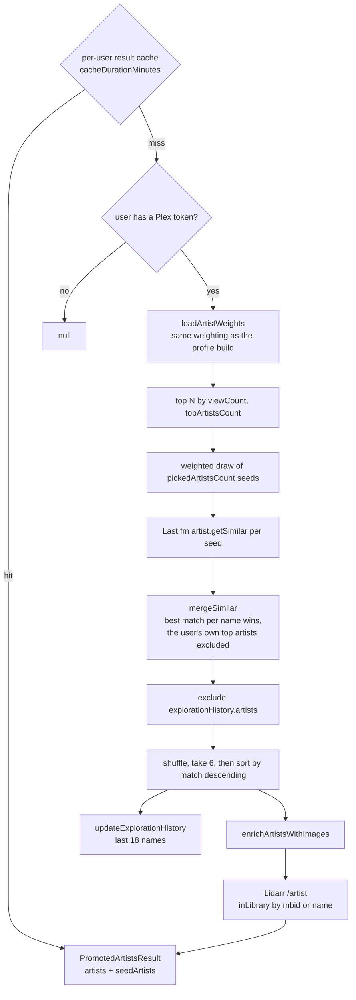

# Promoted artists

Six artists on the Discover page, similar to what the user is playing right now. The only
personal recommender that does not read the persisted profile document for its candidates:
it derives artist weights live off the event log and asks Last.fm for neighbours.

Code: `server/promotedArtists/getPromotedArtists.ts`.

Two details worth keeping straight:

- The **shuffle decides which** artists appear, so repeat visits vary. The **sort only
  decides the order** they are shown in, strongest match first, so the grid reads best to
  worst from where the eye starts.
- Anti-repeat is a soft filter. If fewer than six fresh artists remain, the full merged pool
  is used instead: a repeat beats an empty grid.

Failures degrade rather than propagate. A failed `artist.getSimilar` for one seed returns an
empty list, and an unreachable Lidarr means everything reads as not in library.
