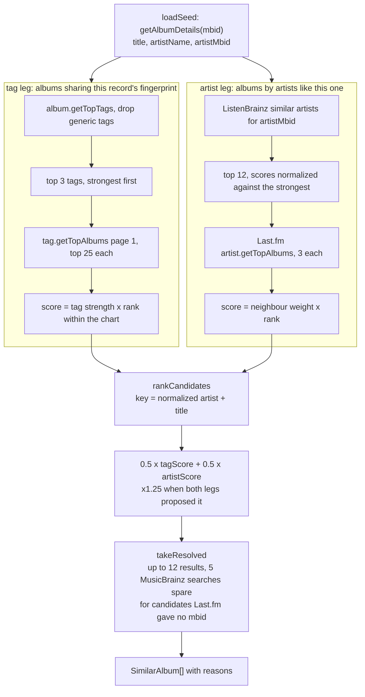

# Similar albums

Shown on the album page. Deliberately impersonal: nothing here depends on who is asking,
which is what lets one 6 hour cache entry serve every user and keeps the page describing the
album rather than the viewer. In-library state is applied by the client, which already
holds it.

Code: `server/services/similarAlbums/`.

Notes on the choices:

- **Keyed on normalized artist + title, not mbid.** Last.fm supplies an mbid only sometimes,
  so keying on it would file the same album twice whenever one leg carried one and the other
  did not.
- **The both-legs boost is the only corroboration available.** Album similarity here is
  synthesized rather than measured, so two independent recipes agreeing is worth more than
  either leg scoring something highly alone.
- **The seed's own artist is excluded**, along with the seed album itself.
- **Resolution is budgeted.** A candidate without a release-group mbid cannot be rendered at
  all (route and cover art are both keyed by it), so five searches are spent on the ranked
  head and the rest are dropped. Each search takes a paced interactive slot that preempts
  the pollers.
